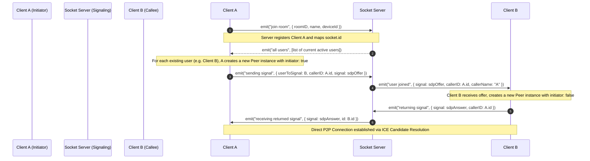

# LinkUp 🎥 Technical Interview Preparation Guide

This guide compiles high-yield, production-grade technical interview questions and comprehensive answers based on the architecture, source code, and design decisions of the **LinkUp** video conferencing and live-streaming application. Use this to prepare for Full-Stack, WebRTC, Node.js, and System Design interviews.

---

## Table of Contents
1. [WebRTC & Signaling (Mesh P2P Architecture)](#1-webrtc--signaling-mesh-p2p-architecture)
2. [RTMP Live Streaming & Canvas Compositing](#2-rtmp-live-streaming--canvas-compositing)
3. [Socket.io & Real-Time Connection Management](#3-socketio--real-time-connection-management)
4. [Security, Middleware & Database Design](#4-security-middleware--database-design)
5. [System Design, Scalability & Production Bottlenecks](#5-system-design-scalability--production-bottlenecks)

---

## 1. WebRTC & Signaling (Mesh P2P Architecture)

### Q1.1: LinkUp uses a mesh topology for video conferencing. What does this mean, and what are the trade-offs compared to SFU (Selective Forwarding Unit) and MCU (Multipoint Control Unit) topologies?
**Answer:**
A **Mesh network (P2P)** establishes direct WebRTC media channels between every participant. If there are $N$ participants, each peer must maintain $N - 1$ upstream (upload) connections and $N - 1$ downstream (download) connections, resulting in a total bandwidth and connection scale of $O(N^2)$ across the room.

```
       [ Mesh (O(N^2)) ]                 [ SFU (O(N)) ]
        PeerA <=======> PeerB               PeerA        PeerB
          ^               ^                  \  /        \  /
          |               |                   \/          \/
          v               v                  [    SFU     ]
        PeerD <=======> PeerC                 /\          /\
                                             /  \        /  \
                                            PeerD        PeerC
```

#### Topologies Comparison:
*   **Mesh (P2P)**:
    *   *Pros*: Zero server media processing cost, server-less latency (direct client-to-client), and privacy (end-to-end encryption by default).
    *   *Cons*: CPU and upload bandwidth intensive on the client. Unusable for rooms larger than 5–8 active participants.
*   **SFU (Selective Forwarding Unit)**:
    *   *Pros*: Clients publish only **1 upstream feed** and subscribe to $N-1$ downstream feeds ($O(N)$ upload bandwidth). Very popular in modern apps like Zoom, Teams, and Google Meet.
    *   *Cons*: Server incurs high bandwidth costs, decrypts/re-encrypts packets (optional), and loses direct peer-to-peer latency.
*   **MCU (Multipoint Control Unit)**:
    *   *Pros*: Clients publish **1 stream** and receive **1 mixed stream** from the server ($O(1)$ bandwidth). Perfect for low-bandwidth legacy clients.
    *   *Cons*: Massive server CPU transcoding costs (decoding, mixing layout, and encoding for every room).

**Why Mesh was chosen for LinkUp:** LinkUp prioritizes direct, ultra-low-latency calls without paying for expensive media-forwarding server infrastructure. P2P signaling utilizes the `simple-peer` wrapper to negotiate direct connections via standard STUN servers.

---

### Q1.2: Walk me through the WebRTC signaling flow inside LinkUp. What socket events are emitted, and how are SDP offers and answers exchanged?
**Answer:**
WebRTC requires an out-of-band **Signaling Server** (implemented via Socket.io in Node.js) to exchange session metadata (SDP - Session Description Protocol) and ICE candidates before peers can connect directly.

The exact signaling flow in `MeetingRoom.jsx` is as follows:



1.  **Join Room:** The joining client A captures media via `getUserMedia` and sends `join room` to the socket.
2.  **User Discovery:** The socket server responds with `all users`, sending A a list of all active peer socket IDs.
3.  **Initiating Offer:** For *each* peer in that list, A instantiates an **initiator** `simple-peer` object. The peer object automatically generates an SDP Offer containing A’s codecs and media configurations.
4.  **Forwarding Offer:** Client A emits `sending signal` to the server, which is forwarded to client B as `user joined`.
5.  **Responding with Answer:** Client B receives A's offer, initializes a **non-initiator** `simple-peer` pre-seeded with the offer, and generates an SDP Answer. B emits `returning signal` containing the answer back to the server.
6.  **Establishing P2P:** The server forwards B's answer to A via `receiving returned signal`. A feeds the answer into its peer object. NAT traversal completes, and media streams flow directly.

---

### Q1.3: What are STUN and TURN servers? How are they configured in LinkUp, and why are they necessary in real-world deployments?
**Answer:**
In standard networks, computers sit behind NAT (Network Address Translation) and Firewalls, which block direct incoming connections and conceal local IP addresses.

*   **STUN (Session Traversal Utilities for NAT):** A lightweight server that tells a client their public-facing IP address and port. This is configured in LinkUp's simple-peer configuration:
    ```javascript
    config: {
      iceServers: [
        { urls: "stun:stun.l.google.com:19302" },
        { urls: "stun:stun1.l.google.com:19302" },
      ],
    }
    ```
    This works for ~80% of consumer routers.
*   **TURN (Traversal Using Relays around NAT):** If both peers are behind a Symmetric NAT (common in corporate and university networks), direct P2P is impossible. In this scenario, media must be routed through a **TURN Relay Server**.
*   **Why they are necessary:** Without TURN, up to 15-20% of WebRTC calls will fail to connect (stuck at "connecting..."). For a production version of LinkUp, we would add TURN server credentials (e.g., via Coturn or Xirsys) in the `iceServers` array:
    ```javascript
    {
      urls: "turn:myturnserver.com:3478",
      username: "authorized_user",
      credential: "secure_password"
    }
    ```

---

## 2. RTMP Live Streaming & Canvas Compositing

### Q2.1: Explain the high-level architecture of LinkUp’s YouTube Live Streaming feature. How does media flow from multiple clients to a single YouTube Broadcast?
**Answer:**
LinkUp achieves live RTMP streaming using a hybrid **Client-Side Compositing & Server-Side Transcoding** pipeline. This avoids resource-intensive media mixing on the Node.js server.

```
+------------+       +------------+
|  Client A  | ====> |  Client B  |
|  (Camera)  |       |  (Camera)  |
+------------+       +------------+
      \\               //  (WebRTC Peer Streams)
       \\             //
     +-------------------+
     |    Host Client    |  <-- 1. Combines Peer streams on a hidden <canvas>
     | (Grid Compositor) |  <-- 2. Mixes Audio tracks via Web Audio API
     +-------------------+
               | (WebM Video/Audio Stream)
               | 3. Continuous chunking (2000ms intervals) via MediaRecorder
               v
     +-------------------+
     |    Node Server    |  <-- 4. Ingests raw WebM binary via WebSockets (stream-data)
     | (FFmpeg Subproc)  |  <-- 5. Passes chunks sequentially to ffmpeg.stdin
     +-------------------+
               | (Transcoded H.264/AAC FLV)
               | 6. RTMP Push Protocol
               v
     +-------------------+
     |   YouTube Live    |
     +-------------------+
```

#### The Media Flow Stages:
1.  **Canvas Drawing (Grid Compositing):** The host's browser dynamically draws chosen participant `<video>` streams onto an HTML5 `<canvas>` using a grid layout layout grid (2x2, 3x3, etc.) running at 8 frames per second.
2.  **Audio Summing:** The Web Audio API routes all selected participant mic feeds into a single `MediaStreamDestination`.
3.  **Client Recording & Chunking:** The composited `<canvas>` stream and the summed audio stream are combined. A browser `MediaRecorder` encodes them into a single `video/webm` stream, chunking it every 2000ms.
4.  **WebSocket Transit:** Binary WebM array buffers are sent to the Node.js backend over Socket.io using the `stream-data` event.
5.  **FFmpeg Transcoding:** Node.js receives the chunks and writes them into the `stdin` of a spawned FFmpeg child process.
6.  **RTMP Push:** FFmpeg transcodes the incoming WebM payload into H.264 video (`libx264`) and AAC audio, wrapping it in an FLV container to natively push it to YouTube's ingest endpoint (`rtmp://a.rtmp.youtube.com/live2`).

---

### Q2.2: Walk me through the implementation details of client-side video compositing and audio mixing in `MeetingRoom.jsx`.
**Answer:**

#### 1. Video Compositing (Canvas Grid Mixer):
The video track mixing is done by dynamically rendering active streams onto an off-screen `<canvas>` at a fixed frame rate (8 FPS):
```javascript
const canvas = canvasRef.current;
canvas.width = 320;
canvas.height = 240;
const ctx = canvas.getContext("2d");

const drawMixer = () => {
  ctx.fillStyle = "black";
  ctx.fillRect(0, 0, canvas.width, canvas.height);
  
  const count = mixerVideoRefs.current.length;
  if (count > 0) {
    let cols = 1, rows = 1;
    if (count === 2) { cols = 2; rows = 1; }
    else if (count <= 4) { cols = 2; rows = 2; }
    else if (count <= 9) { cols = 3; rows = 3; }
    else { cols = 4; rows = 4; }

    const cellW = canvas.width / cols;
    const cellH = canvas.height / rows;

    mixerVideoRefs.current.forEach((vEl, idx) => {
      const c = idx % cols;
      const r = Math.floor(idx / cols);
      const x = c * cellW;
      const y = r * cellH;
      ctx.drawImage(vEl, x, y, cellW, cellH);
    });
  }
  animFrameRef.current = requestAnimationFrame(drawMixer);
};
```
*   **Grid Logic:** Based on participant count, it calculates row/column counts and sizes, then draws each `<video>` frame on the canvas in its corresponding grid coordinates.

#### 2. Audio Mixing (Web Audio API Node Graph):
To mix multiple mic inputs into one stream, the app builds a Web Audio graph:
```javascript
const audioCtx = new AudioContext();
const destination = audioCtx.createMediaStreamDestination();

selectedParticipants.forEach(p => {
  let stream = getStreamForParticipant(p);
  if (stream && stream.getAudioTracks().length > 0) {
    // 1. Create a media stream source from the WebRTC stream
    const source = audioCtx.createMediaStreamSource(stream);
    // 2. Connect the source directly to the destination node (mixer)
    source.connect(destination);
  }
});
```
*   **Result:** The `destination.stream` exposes a single audio track containing a real-time down-mixed sum of all active participants' mics.

---

### Q2.3: Spawning FFmpeg as a server-side subprocess can be unstable. What parameters are passed to your FFmpeg pipeline, and what do they mean?
**Answer:**
The Node.js server spawns FFmpeg with specific flags optimized for fast, real-time RTMP conversion:
```javascript
const ffmpegProcess = spawn(ffmpegPath, [
  "-loglevel", "error",
  "-fflags", "+genpts+discardcorrupt",
  "-err_detect", "ignore_err",

  "-f", "webm",             // Ingest WebM container format
  "-i", "-",                // Receive input directly from stdin stream

  "-c:v", "libx264",        // Transcode video to H.264
  "-preset", "ultrafast",   // Fast encoding preset to reduce latency
  "-tune", "zerolatency",   // Tune encoder settings for real-time live streaming

  "-b:v", "500k",           // Match target video bitrate
  "-maxrate", "500k",       // Max rate cap
  "-bufsize", "1000k",      // Sync buffer size

  "-pix_fmt", "yuv420p",    // Pixel format required by YouTube/players
  "-g", "20",               // Group of Pictures (GOP) size (keyframe interval)
  "-r", "8",                // Set output frame rate (matches canvas capture at 8fps)

  "-c:a", "aac",            // Transcode audio to AAC
  "-b:a", "64k",            // Set audio bitrate

  "-f", "flv",              // Wrap transcoded streams into Flash Video (FLV) container
  outputUrl                 // YouTube RTMP Ingest Endpoint URL + Stream Key
]);
```

#### Key Transcoding Details:
*   `"-fflags", "+genpts"`: Recalculates missing Presentation Timestamps (PTS) on the fly, preventing stream freezes when socket chunks arrive slightly out of sync.
*   `"-preset", "ultrafast"`: Dramatically reduces server CPU usage by telling H.264 to use the fastest and least intensive compression algorithms.
*   `"-tune", "zerolatency"`: Disables internal frame-buffering in the encoder to ensure instant RTMP forwarding.
*   `"-g", "20"`: Enforces a keyframe every 20 frames. At 8 FPS, this translates to a keyframe roughly every 2.5 seconds, which satisfies YouTube's requirement for consistent keyframes.

---

### Q2.4: Node.js standard input is blocking, and WebSockets arrive asynchronously. How does your backend handle chunk writing without crashing the pipe?
**Answer:**
Writing WebSocket buffers directly into standard input (`ffmpeg.stdin.write(chunk)`) is highly prone to **write errors** (e.g., `EPIPE` or `ERR_STREAM_WRITE_AFTER_END`) if the network experiences jitter or if FFmpeg is momentarily busy processing.

To prevent this, the backend implements an **asynchronous sequential queue** wrapper for each active broadcast:
```javascript
roomStreamers.set(roomID, {
  ffmpeg: ffmpegProcess,
  queue: [],
  writing: false,
  processQueue() {
    // If currently writing a chunk or queue is empty, do nothing
    if (this.writing || this.queue.length === 0) return;
    
    this.writing = true;
    const chunk = this.queue.shift(); // Get next buffer in queue
    
    try {
      if (this.ffmpeg.stdin.writable) {
        this.ffmpeg.stdin.write(chunk, (err) => {
          if (err) console.error("FFmpeg write error", err);
          this.writing = false;
          this.processQueue(); // Process next item after write completes
        });
      } else {
        this.writing = false;
      }
    } catch (e) {
       console.error("FFmpeg write sync error", e);
       this.writing = false;
    }
  }
});
```

#### How this solves pipeline stability:
1.  **Buffering:** Arriving binary buffers are pushed to an in-memory `queue` array immediately.
2.  **Backpressure & Synchronization:** The `writing` flag acts as a lock. It ensures that `stdin.write` is only called once the previous chunk has been successfully drained and written to the OS sub-process buffer (via the write callback).
3.  **Graceful Recovery:** The `try-catch` wrapper blocks standard `EPIPE` exceptions from raising uncaught Node errors and crashing the entire server process.

---

## 3. Socket.io & Real-Time Connection Management

### Q3.1: How does LinkUp prevent duplicate participation from the same browser device? Explain the logic in `server.js` and `MeetingRoom.jsx`.
**Answer:**
If a user refreshes their browser or opens a second tab with the same credentials, it can cause duplicate WebRTC connection offers. This leads to severe audio feedback loops and system instability.

LinkUp prevents this using a unique **DeviceID** stored in the browser's `localStorage` and sent during the `join room` handshake.

```
[ New Client Connects ] 
        |
        v
Sends: { roomID, deviceId: "UUID-XYZ" }
        |
        +---> Node server looks up active users mapping in Room
                |
                v
        [ Does deviceId already exist? ]
               /            \
             Yes             No
             /                 \
    1. Retrieve old Socket ID   1. Register new Socket ID
    2. Emit "duplicate-kicked"  2. Proceed to room joining
    3. Force disconnect old connection
```

#### Server-Side Implementation (`server.js`):
```javascript
if (deviceId) {
  for (const [sid, meta] of usersMap.entries()) {
    if (meta.deviceId === deviceId) {
      const oldSocket = io.sockets.sockets.get(sid);
      if (oldSocket) {
        oldSocket.leave(roomID);
        oldSocket.emit("duplicate-kicked");
        oldSocket.disconnect(true);
      }
      usersMap.delete(sid);
      // Clean up old participant entry in Database
      await Meeting.findOneAndUpdate(
        { meetingId: roomID },
        { $pull: { participants: { deviceId } } }
      );
    }
  }
}
```
*   **Result:** When a user opens a new window, the server kicks the older socket, disconnects it, and registers the new socket connection.

---

### Q3.2: Why is the `maxHttpBufferSize` configuration option set to `1e8` (100MB) on the Socket.io server?
**Answer:**
By default, Socket.io caps incoming packet payload sizes at **1MB** (configured via `maxHttpBufferSize`).

```javascript
const io = new Server(server, {
  cors: { origin: process.env.CLIENT_URL || "*", methods: ["GET", "POST"] },
  maxHttpBufferSize: 1e8, // 100 Megabytes
});
```

#### Why this is required:
*   In LinkUp, the host streams live raw binary WebM chunks via WebSocket using the `stream-data` event.
*   Depending on the video content, resolution, dynamic movement, and the client-side recorder's encoding parameters, individual 2-second chunks can occasionally spike past 1MB.
*   Without setting `maxHttpBufferSize: 1e8`, Socket.io will automatically trigger a **packet overflow error** when a large chunk is sent. This abruptly closes the websocket connection, terminating the meeting.

---

## 4. Security, Middleware & Database Design

### Q4.1: Explain the authorization model in LinkUp. What is the difference between your `protect` and `optionalAuth` Express middlewares?
**Answer:**
LinkUp manages two types of requests: operations that require authentication (like creating a meeting) and operations that allow guest access (like joining an existing meeting via a shared link).

#### 1. `protect` Middleware (Enforced Authentication):
```javascript
export const protect = async (req, res, next) => {
  try {
    const authHeader = req.headers.authorization || "";
    const token = authHeader.startsWith("Bearer ") ? authHeader.split(" ")[1] : null;
    
    if (!token) return res.status(401).json({ msg: "No token, authorization denied" });

    const decoded = jwt.verify(token, process.env.JWT_SECRET);
    const user = await User.findById(decoded.id).select("-password");
    if (!user) return res.status(401).json({ msg: "User not found" });

    req.user = user; // Attach user to the request context
    next();          // Proceed to route handler
  } catch (err) {
    return res.status(401).json({ msg: "Token is not valid" });
  }
};
```
*   **Usage:** Used on critical endpoints like `/api/meetings/create` and `/api/meetings/end`. It blocks access if a valid signed JWT is not present in the headers.

#### 2. `optionalAuth` Middleware (Flexible Authorization):
```javascript
export const optionalAuth = async (req, res, next) => {
  try {
    const authHeader = req.headers.authorization || "";
    const token = authHeader.startsWith("Bearer ") ? authHeader.split(" ")[1] : null;

    if (token) {
      const decoded = jwt.verify(token, process.env.JWT_SECRET);
      req.user = await User.findById(decoded.id).select("-password");
    }
  } catch (err) {
    req.user = null; // Suppress errors, treat as guest
  }
  next(); // Always proceed
};
```
*   **Usage:** Used on `/api/meetings/join`. If the user is logged in, their user record is loaded so the DB registers their registered name and metadata. If the user is not logged in, `req.user` is left empty, allowing them to join the room as a guest by entering a nickname.

---

### Q4.2: How are meeting passcodes secured and verified in the database?
**Answer:**
For security, meeting join links contain the plaintext password, but we must protect the meeting passcodes from unauthorized access. LinkUp secures them inside MongoDB using **one-way cryptographic hashing** via `bcryptjs`.

#### Flow of Passcode Management:
1.  **Creation:** When creating a meeting room, a randomized passcode is hashed on the server with a salt factor of 10 before saving:
    ```javascript
    const hashedPassword = await bcrypt.hash(password, 10);
    const meeting = await Meeting.create({
      meetingId,
      password: hashedPassword,
      host: req.user._id,
      expiresAt,
    });
    ```
2.  **Verification:** When a user or guest attempts to join a meeting, they submit the passcode via the request body. The API matches it using `bcrypt.compare`:
    ```javascript
    const isMatch = await bcrypt.compare(password, meeting.password);
    if (!isMatch) return res.status(401).json({ msg: "Invalid password" });
    ```
    This securely verifies passwords without storing them in plaintext on the database.

---

## 5. System Design, Scalability & Production Bottlenecks

### Q5.1: WebRTC Mesh topology does not scale. If you had to re-architect LinkUp to support 100+ active video participants in a single room, how would you design it?
**Answer:**
To support more than 10–15 participants, we must replace the P2P Mesh architecture with a centralized **SFU (Selective Forwarding Unit)** media server.

#### Proposed Re-architecture System Design:

```
[ Clients (WebRTC publish/subscribe) ]
   Client 1 (Publish Cam 1) -------> +----------------------------+
   Client 2 (Publish Cam 2) -------> |                            | ===> (Distributes video streams)
                                     |    Mediasoup / Pion SFU    | ===> (Only sends active speakers)
   Client 1 <--- Subscribe Cam 2 --- |                            |
   Client 2 <--- Subscribe Cam 1 --- +----------------------------+
                                                   ^
                                                   | (Orchestrates SDP Signaling & tracks)
                                     +----------------------------+
                                     |    Node/Socket.io API      |
                                     +----------------------------+
```

1.  **Incorporate an SFU Engine:** Integrate open-source media servers like **Mediasoup** (C++/Node.js) or **Pion** (Go/WebRTC wrapper).
2.  **Publisher Stream Pipeline:** Each client publishes exactly **one** video and audio track to the SFU server ($O(1)$ client upload bandwidth).
3.  **Subscriber Stream Pipeline:** The SFU distributes those streams to other participants ($O(N)$ download bandwidth).
4.  **Optimizations for Scalability:**
    *   **Simulcast / Temporal Scalability:** Clients publish video at three resolutions (e.g., 180p, 360p, 720p). The SFU dynamically sends the lower resolution feed to users with poor network connections or when the participant's video card is scaled down in the UI.
    *   **Active Speaker Detection:** Instead of sending all 100 video feeds, only forward video tracks for the top 6-9 active speakers. Send only audio tracks for the remaining participants.

---

### Q5.2: The FFmpeg live-streaming feature is CPU-heavy. How would you scale the streaming backend in production to handle hundreds of active broadcasters?
**Answer:**
Running FFmpeg child processes directly on the main Express application server is a major bottleneck. A single live-stream transcoding process can consume 30-50% of a standard CPU core, quickly degrading API performance and disconnecting active websocket calls.

#### Scalability Solution: Distributed Transcoding Architecture
We should move the transcoding workload off the main web servers and onto a auto-scaling worker cluster:

```
+--------------+       +--------------+
| Host Browser |       | Host Browser |
+--------------+       +--------------+
       \                      /
  (Websocket stream-data array buffer)
         \                  /
    +----------------------------+
    |  Socket.io Gateway Server  | (Stateless proxy server)
    +----------------------------+
                  |
         (Redis Pub/Sub Bus)
                  v
    +----------------------------+
    |    RabbitMQ / Kafka Queue  | (Distributes encoding tasks)
    +----------------------------+
         /            |         \
        v             v          v
   +----------+  +----------+  +----------+
   | Worker 1 |  | Worker 2 |  | Worker 3 |  <-- (Spawns and monitors FFmpeg)
   +----------+  +----------+  +----------+
   (Worker nodes scale dynamically based on total active streams)
```

1.  **Stateless WebSocket Gateways:** The main API server handles HTTP routes and basic WebRTC signaling. All socket stream-data packets are routed to dedicated gateway servers.
2.  **Message Queue Decoupling:** Gateway servers forward the incoming binary buffers to a high-speed message broker like **Apache Kafka** or a **Redis Pub/Sub** bus.
3.  **Dedicated Transcoding Workers:** Worker servers pull stream buffers from the queue and pipe them into their local FFmpeg processes.
4.  **Auto-Scaling Policies:** We can host these worker nodes on Kubernetes (EKS) or ECS and configure auto-scaling policies based on CPU utilization or queue length. This allows the system to dynamically spin up new workers as more users start live streams.
5.  **Hardware Acceleration (GPU):** In production, we can use GPU-enabled worker instances and configure FFmpeg to use hardware-accelerated encoders like NVENC (`h264_nvenc`) instead of standard CPU encoders (`libx264`). This shifts the CPU transcoding workload to high-performance GPUs.
