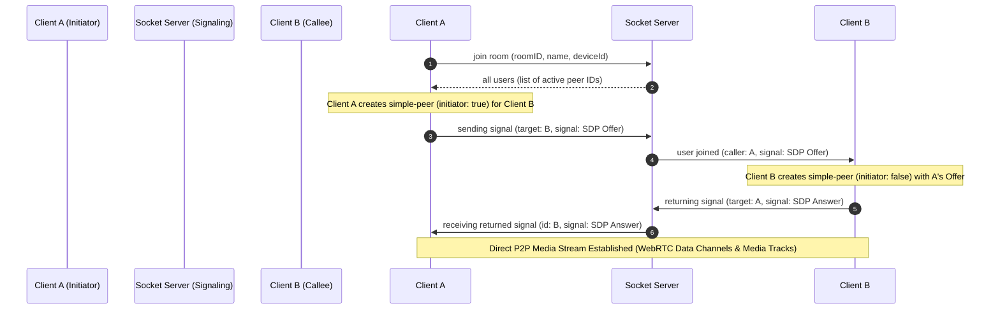

<div align="center">
  
  # LinkUp 🎥

  [](https://github.com/khanparaYash/LinkUp)
  [](https://webrtc.org/)
  [](https://socket.io/)
  [](https://ffmpeg.org/)
  [](https://opensource.org/licenses/ISC)

  A Production-Grade, Full-Stack Video Conferencing & Real-Time RTMP Live Streaming Platform

  [Overview](#1-project-overview) · [Key Features](#2-key-features) · [Architecture & Workflows](#3-architecture--workflows) · [Installation Guide](#4-installation-guide) · [API & Sockets](#5-api--socket-reference) · [Project Structure](#6-project-structure) · [License](#8-license)
</div>

---

## 1. Project Overview

**LinkUp** is a state-of-the-art, production-ready video conferencing and live-streaming application built on the **MERN Stack** (MongoDB, Express.js, React, Node.js). 

It implements a low-latency, high-performance direct **Mesh P2P network** using **WebRTC** (`simple-peer` wrapper) and **Socket.io** signaling. 

Additionally, LinkUp features a server-side **RTMP broadcasting engine**. The host's client dynamically mixes participant video streams using the **HTML5 Canvas API** and down-mixes audio channels using the **Web Audio API**. It then streams chunked WebM video to the Node.js backend over WebSockets, where an asynchronous queuing system pipes it to a spawned **FFmpeg** process to transcode and push H.264/AAC media directly to YouTube Live.

---

## 2. Key Features

*   **⚡ Real-Time P2P Calling:** Dynamic, low-latency audio/video connections running on WebRTC mesh architecture.
*   **📺 YouTube Live Ingestion (RTMP):** Host-controlled live streaming that composites dynamic grid feeds and sums mic feeds entirely in the client browser, streaming raw binary chunks via WebSockets to server-side FFmpeg for real-time RTMP publishing.
*   **💻 Screen Sharing:** Seamlessly switch from standard camera feeds to screen sharing in real-time, utilizing WebRTC sender-track swap mechanisms (`replaceTrack`) to avoid connection renegotiation.
*   **👑 Comprehensive Host Privileges:** Real-time host controls to force-mute individual participants, remove users from the room, and end meetings.
*   **💬 In-Meeting Group Chat:** Real-time persistent group chat built on Socket.io and securely stored in MongoDB for future review.
*   **🔒 Secure Authentication & Route Protection:** Cryptographic password hashing using `bcryptjs`, secure session tokens using JSON Web Tokens (JWT), and token expiration handling.
*   **🎙️ Active Speaker Highlighting:** Automated real-time speaking detection on both local and remote tracks using frequency-band analyses via the Web Audio API's `AnalyserNode`.
*   **🚫 Device Duplication Protection:** Prevents duplicate logins from the same device in the same meeting room using browser UUID handshakes.

---

## 3. Architecture & Workflows

### 3.1 WebRTC Signaling & Connection Sequence

Before two participants can exchange peer-to-peer audio and video, they must exchange network metadata (ICE Candidates) and media configurations (SDP) through Node.js acting as a signaling hub.



---

### 3.2 YouTube Live RTMP Broadcasting Workflow

To enable live streaming without overloading server CPU resources with complex grid transcoding, LinkUp offloads video rendering and audio mixing to the host client.

```mermaid
flowchart TD
    subgraph Client-Side (Host Browser)
        A[Incoming WebRTC Streams] --> B[HTML5 Canvas Grid Composer]
        A --> C[Web Audio API Summing Node]
        B --> D[Combined MediaStream]
        C --> D
        D --> E[MediaRecorder - video/webm]
        E -->|Continuous 2000ms chunking| F[WebSocket Emitting stream-data]
    end

    subgraph Server-Side (Node.js & FFmpeg)
        F -->|Array Buffer Chunks| G[Socket.io Listener]
        G --> H[Asynchronous Sequential Queue]
        H -->|Pipes chunk buffers safely| I[FFmpeg Child Process stdin]
        I -->|Transcodes H.264 & AAC| J[YouTube RTMP Ingest URL]
    end
```

1.  **Grid Composition:** The host's client draws video frames from active streams onto an off-screen `<canvas>` at 8 FPS, resizing them into dynamic grids.
2.  **Audio Summing:** Active streams' audio tracks are connected to a `MediaStreamAudioSourceNode` and combined into a single `MediaStreamAudioDestinationNode`.
3.  **Encoding:** A client-side `MediaRecorder` takes the combined stream and packages it as high-efficiency WebM data.
4.  **WebSocket Transit:** Chunks are sent to the Node.js server via websocket packets at 2-second intervals.
5.  **Sequential Queue Buffering:** The backend pushes binary buffers into an asynchronous queue and writes them to FFmpeg's standard input (`stdin`) sequentially. This prevents backpressure and pipeline crashes.
6.  **RTMP Push:** FFmpeg transcodes the streams into H.264 video (`libx264`) and AAC audio (`c:a aac`) and pushes them to YouTube using a Flash Video (FLV) container.

---

### 3.3 Dynamic Screen Sharing Track Swap

Instead of tearing down the WebRTC connection or executing an expensive renegotiation flow (Offer/Answer) when a user shares their screen, LinkUp utilizes direct WebRTC track swapping:

```javascript
const screenStream = await navigator.mediaDevices.getDisplayMedia({ video: true });
const screenTrack = screenStream.getVideoTracks()[0];

peersRef.current.forEach((peerObj) => {
  // Locate the existing camera track sender
  const videoSender = peerObj.peer._pc
    .getSenders()
    .find((s) => s.track && s.track.kind === "video");
  
  // Swap standard camera track with screen capture track dynamically
  if (videoSender) videoSender.replaceTrack(screenTrack);
});
```

---

## 4. Installation Guide

### Prerequisites
*   **Node.js:** v18.x or later installed locally.
*   **MongoDB:** Local instance running on port `27017` or a MongoDB Atlas cloud URI.
*   **FFmpeg:** Installed on the host operating system and added to your system path.

---

### 1. Clone the repository
```bash
git clone https://github.com/khanparaYash/LinkUp.git
cd "MERN LinkUp"
```

### 2. Setup Backend Server
```bash
cd server
npm install
```
Configure environment variables in a `/server/.env` file:
```env
PORT=5000
MONGO_URI=mongodb+srv://<username>:<password>@cluster.mongodb.net/LinkUp
JWT_SECRET=your_super_secret_jwt_key
JWT_EXPIRES_IN=1d
CLIENT_URL=http://localhost:5173
```

### 3. Setup Frontend Client
```bash
cd ../client
npm install
```
Configure environment variables in a `/client/.env` file:
```env
VITE_BACKEND=http://localhost:5000
```

### 4. Running the Application

**Terminal 1 (Backend Node Server):**
```bash
cd server
npm run dev
# Server running on http://localhost:5000
```

**Terminal 2 (Frontend React App):**
```bash
cd client
npm run dev
# Frontend running on http://localhost:5173
```

---

## 5. API & Socket Reference

### 5.1 REST Endpoints

| Resource | Method | Endpoint | Authorization | Description |
| :--- | :--- | :--- | :--- | :--- |
| **Auth** | `POST` | `/api/auth/register` | Public | Registers a new user. Hashes the password with bcrypt. |
| **Auth** | `POST` | `/api/auth/login` | Public | Verifies credentials and issues a signed JWT. |
| **Auth** | `GET` | `/api/auth/me` | Protected | Returns the logged-in user's profile. |
| **Meeting** | `POST` | `/api/meetings/create` | Protected | Creates a new meeting room and returns a passcode. |
| **Meeting** | `POST` | `/api/meetings/join` | Optional | Verifies meeting passcodes and grants room access. |
| **Meeting** | `POST` | `/api/meetings/end` | Protected | Terminates a meeting room (Host-only). |
| **Chat** | `POST` | `/api/chat/history` | Protected | Retrieves persistent chat history for a meeting room. |

---

### 5.2 Socket.io Event Bindings

*   **Room Orchestration:**
    *   `join room`: Transmits participant credentials, browser DeviceID, and default media configurations.
    *   `all users`: Broadcasts active peer IDs to newly connected users.
    *   `user joined` / `participant left`: Dispatches notifications when users enter or exit the room.
    *   `duplicate-kicked`: Sent to older sockets from the same device to prevent session collision.
*   **WebRTC Signaling:**
    *   `sending signal` / `returning signal`: Routes ICE SDP offers and answers between peers.
*   **Host Control Broadcasts:**
    *   `host-force-mute` / `force-mute`: Dispatches mute commands to a targeted socket.
    *   `host-remove-user` / `removed-by-host`: Remotely disconnects a participant and redirects them home.
    *   `host-end-meeting` / `meeting-ended`: Closes active sessions and shuts down the database registry.
*   **RTMP Streaming Engine:**
    *   `start-live-stream`: Spawns the backend FFmpeg process and configures the RTMP endpoint.
    *   `stream-data`: Handles binary WebM chunk buffers sent from the client to Node.js.
    *   `stop-live-stream`: Closes the stdin pipeline and shuts down the FFmpeg process.

---

## 6. Project Structure

```text
LinkUp/
├── client/
│   ├── src/
│   │   ├── api/            # Axios instance and API call intercepts
│   │   ├── components/     # Reusable shadcn/ui components (Header, ThemeToggle)
│   │   ├── pages/          # Core views (Home, Login, Register, WaitingRoom)
│   │   │   ├── MeetingRoom.jsx  # Main WebRTC orchestration, canvas grid mixing, WebSocket streaming
│   │   │   ├── Video.jsx        # HTML5 Video container and Audio analyser active speaking highlight
│   │   │   └── Chat.jsx         # Live text messaging panel
│   │   ├── store/          # Redux Toolkit global state store
│   │   └── tailwind.config.js
│   └── package.json
│
└── server/
    ├── middlewere/         # protect and optionalAuth JWT parsers
    ├── models/             # Mongoose schemas (User, Meeting, Chat)
    ├── routes/             # REST routing layers
    ├── server.js           # Express configuration, Socket.io lifecycle handlers, FFmpeg spawns
    └── package.json
```

---

## 7. Performance Optimizations & Architecture Decisions

1.  **Client-Side Grid Composition:** Video grid layout and canvas rendering are offloaded to client browsers. This keeps the Node.js server lightweight and responsive.
2.  **Asynchronous Stream Queue:** The backend uses an asynchronous writing queue to stream binary buffers into FFmpeg. This prevents backpressure issues, socket blocks, and server pipeline crashes.
3.  **Web Audio summation:** Mixing mic feeds into a single audio track on the client keeps audio streams synchronized and reduces server-side audio processing.
4.  **SDP Track Swapping:** Dynamically swapping tracks during screen shares avoids renegotiation latency, preventing connection drops and screen freezes.
5.  **Device-Collision Handshake:** Authenticating and tracking sessions via a hardware UUID stored in local storage stops feedback loops and prevents duplicate tab sessions.

---

## 8. License

This project is licensed under the terms of the **ISC License**.

```text
Copyright (c) 2026, LinkUp Contributors

Permission to use, copy, modify, and/or distribute this software for any
purpose with or without fee is hereby granted, provided that the above
copyright notice and this permission notice appear in all copies.
```
